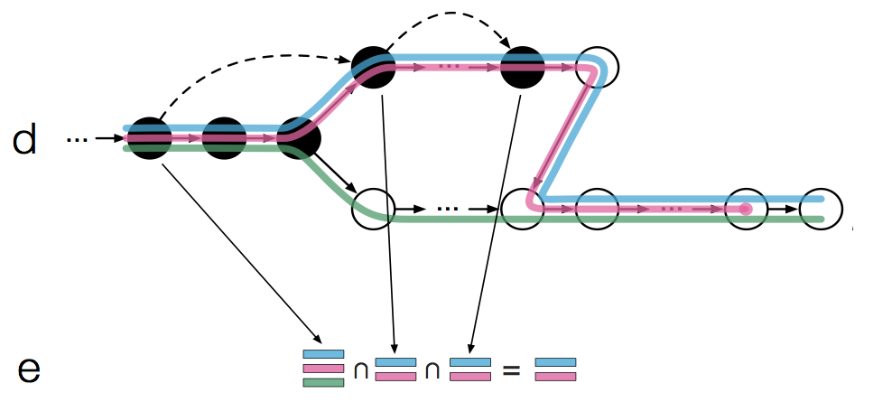
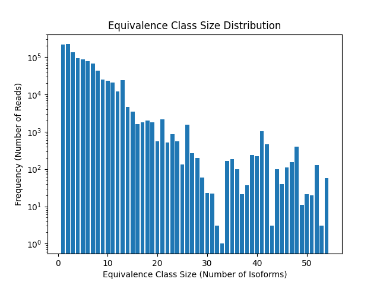

# Pseudo-Alignment Bioinformatics Tool
  <!-- Resized logo to 200px -->


### A Python-based tool for pseudoalignment and equivalence class analysis using k-mers. This tool processes transcriptome files and read files to create k-mer indexes, perform pseudoalignment, and visualize equivalence class statistics, inspired by Kallisto.

### Below is an example of the [Kallisto](https://pachterlab.github.io/kallisto/) pseudoalignment graph:

  <!-- Resized Kallisto image to 500px -->

## Features
- Creates a k-mer index from a transcriptome FASTA file.
- Performs pseudoalignment of reads using k-mers.
- Outputs equivalence class counts and isoform associations.
- Provides visualization of equivalence class size distribution.

## Installation

### Prerequisites
Ensure you have Python 3.8+ installed and install the following dependencies:

```bash
pip install -r requirements.txt
```

### Dependencies
- Biopython
- matplotlib
- tqdm
- pandas

## Running the Tool

```bash
git clone https://github.com/williamhuang3/pseudoaligner.git
cd pseudoaligner
```

To run the pseudoalignment tool, execute the `main.py` script:
```bash
python main.py
```

By default, the script expects the following input files:
- `chr11_transcriptome.fasta`: A FASTA file containing the transcriptome sequences.
- `reads.fasta.gz`: A gzipped FASTA file with the reads to pseudoalign.

You can modify the file paths and parameters directly in the `main.py` file.

The results will be saved to `equivalence_classes.tsv`, and the top 15 equivalence classes will be printed to the console. A plot showing the equivalence class size distribution will also be displayed.

## Example Output

Below is an example of the top 15 equivalence class counts output by the tool:

| Counts | Number of Items in Equivalence Class | Isoforms in Equivalence Class |
|--------|--------------------------------------|-------------------------------|
| 50420  | 2                                    | (ENST00000329251, ENST00000496634) |
| 15022  | 1                                    | (ENST00000449131,)                  |
| 14169  | 6                                    | (ENST00000273550, ENST00000526640, ENST00000532601, ENST00000532829, ENST00000534180, ENST00000620041) |
| 12500  | 1                                    | (ENST00000536684,)                  |
| 10517  | 1                                    | (ENST00000393067,)                  |
| 10039  | 7                                    | (ENST00000227157, ENST00000379412, ENST00000396222, ENST00000422447, ENST00000430553, ENST00000540430, ENST00000545215) |
| 8546   | 5                                    | (ENST00000345732, ENST00000389939, ENST00000532073, ENST00000534668, ENST00000674194) |
| 8168   | 3                                    | (ENST00000321153, ENST00000530398, ENST00000530797) |
| 8113   | 2                                    | (ENST00000321153, ENST00000530797) |
| 7585   | 2                                    | (ENST00000228140, ENST00000525634) |
| 7165   | 2                                    | (ENST00000527673, ENST00000532567) |
| 6416   | 4                                    | (ENST00000273550, ENST00000530019, ENST00000532829, ENST00000620041) |
| 6008   | 8                                    | (ENST00000227378, ENST00000524552, ENST00000526110, ENST00000526686, ENST00000532636, ENST00000533540, ENST00000534319, ENST00000534624) |
| 5989   | 1                                    | (ENST00000260197,)                  |
| 5890   | 3                                    | (ENST00000527673, ENST00000527791, ENST00000532567) |

The following plot shows the distribution of equivalence class sizes based on the number of isoforms:



## File Descriptions

- **`indexer.py`**: Contains the function to create the k-mer index from the transcriptome.
- **`aligner.py`**: Contains the pseudoalignment logic that compares reads against the k-mer index.
- **`utils.py`**: Utility functions, including a function to calculate the reverse complement of a sequence.
- **`plotter.py`**: Functions for plotting the equivalence class size distribution.
- **`main.py`**: The main script that coordinates all the tasks and outputs results.
- **`requirements.txt`**: List of Python packages required to run the code.


